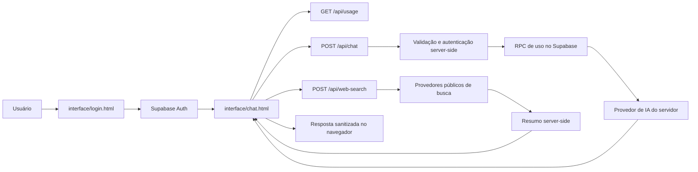

# KAZER

> **KAZER** é um espaço web/PWA de conversa com inteligência artificial para explicar, escrever, organizar ideias, analisar conteúdo e transformar pedidos em próximos passos.
>
> **Titularidade declarada no projeto:** Jean V. / `@jeanvicen` · identidade pública `0neajx` · Klipza Studio. Substitua esta identificação pelos dados legais completos do titular antes de uma publicação comercial ou de um aviso jurídico definitivo.

[](#status-do-projeto) [](#requisitos) [](#publicação-na-vercel)

## Aviso de propriedade e uso

Este repositório contém código, interface, textos, identidade visual, fluxos, regras de produto, configurações e materiais do KAZER. **O projeto não é open source e não concede autorização geral para copiar, modificar, redistribuir, vender, sublicenciar, publicar forks, remover avisos, reutilizar a marca ou criar um serviço derivado.** A simples disponibilidade do repositório no GitHub não deve ser interpretada como uma licença de reutilização; o GitHub recomenda que o projeto declare expressamente a licença e observa que, sem licença, aplicam-se os direitos autorais padrão.[1]

A proteção de software no Brasil é tratada pela legislação de propriedade intelectual e direitos autorais, e a proteção independe de registro segundo a Lei nº 9.609/1998.[2] Este aviso é uma medida documental e contratual; **nenhum texto impede tecnicamente que alguém faça download, cópia ou fork de um repositório público**. Se o objetivo for impedir acesso ao código-fonte, mantenha o repositório privado e publique apenas uma demonstração ou documentação autorizada. Ao mudar um repositório público para privado, forks públicos existentes podem continuar públicos e ser separados da rede original.[3]

As regras completas estão em [`LICENSE.md`](LICENSE.md), [`docs/TERMOS-DE-USO.md`](docs/TERMOS-DE-USO.md), [`docs/AVISO-DE-DIREITOS-AUTORAIS.md`](docs/AVISO-DE-DIREITOS-AUTORAIS.md) e [`CONTRIBUTING.md`](CONTRIBUTING.md). Os textos jurídicos são **rascunhos para revisão de advogado**, especialmente quanto à identificação do titular, jurisdição, consumidor, privacidade, notificações e exploração comercial.

## Sumário

- [Visão geral](#visão-geral)
- [Como o KAZER funciona](#como-o-kazer-funciona)
- [Recursos disponíveis](#recursos-disponíveis)
- [Arquitetura](#arquitetura)
- [Estrutura do repositório](#estrutura-do-repositório)
- [Requisitos](#requisitos)
- [Configuração rápida](#configuração-rápida)
- [Variáveis de ambiente](#variáveis-de-ambiente)
- [Banco Supabase](#banco-supabase)
- [Publicação na Vercel](#publicação-na-vercel)
- [Desenvolvimento local](#desenvolvimento-local)
- [Contratos das APIs](#contratos-das-apis)
- [Segurança](#segurança)
- [Privacidade e retenção](#privacidade-e-retenção)
- [Limites atuais](#limites-atuais)
- [PWA e distribuição móvel](#pwa-e-distribuição-móvel)
- [Verificações](#verificações)
- [Documentos e autoria](#documentos-e-autoria)
- [Status do projeto](#status-do-projeto)
- [Contribuições](#contribuições)
- [Licença](#licença)
- [Referências](#referências)

## Visão geral

O KAZER é uma aplicação estática hospedada na Vercel, com páginas HTML/CSS/JavaScript no diretório `interface/`, funções serverless Node.js no diretório `api/` e autenticação, preferências, avisos, uso e retenção de conta apoiados pelo Supabase. O processamento de chat usa um provedor de modelos configurado no servidor; a pesquisa do WebKazer utiliza provedores públicos de busca e um serviço de resumo configurado no servidor.

A interface pode funcionar como site responsivo e como PWA instalável. O fluxo de conta usa Supabase Auth, a sessão é mantida no navegador e as rotas privadas exigem o bearer token da sessão. A conversa exibida é mantida em memória no navegador durante a sessão da página; o botão **Nova conversa** limpa o histórico visual local daquele fluxo.

> **Importante:** respostas geradas por IA podem conter erros, omissões ou interpretações incompletas. O KAZER não substitui orientação médica, jurídica, financeira, profissional, atendimento de emergência ou julgamento humano responsável.

## Como o KAZER funciona

O fluxo principal segue quatro etapas. Primeiro, a pessoa cria uma conta ou entra pelo Supabase Auth. Depois, a tela `interface/chat.html` recupera a sessão, carrega o perfil e as preferências e consulta o uso disponível. Ao enviar uma mensagem, o navegador envia apenas o histórico permitido e os anexos selecionados para `POST /api/chat`, sempre com autenticação. A API valida origem, sessão, tamanho, conteúdo, anexos, moderação e limites de uso antes de chamar o provedor de IA. Por fim, a resposta é sanitizada e renderizada na interface.

O WebKazer é um fluxo separado. A pessoa abre **Perfil → Mais opções → WebKazer**, escolhe o modo de pesquisa e envia uma consulta para `POST /api/web-search`. A API consulta fontes públicas permitidas, limita a resposta, pede um resumo ao serviço configurado e devolve fontes e resumo para a interface. O usuário pode abrir as fontes ou enviar o resultado como contexto ao chat.



## Recursos disponíveis

| Recurso | O que faz | Onde está implementado |
|---|---|---|
| Conta | Cadastro, login, sessão persistente, logout e perfil básico. | `interface/login.html`, Supabase Auth e `profiles`. |
| Chat | Conversa com histórico da página, respostas em Markdown simples e geração progressiva visual. | `interface/chat.html` e `api/chat.js`. |
| Imagens | Envio de JPEG, PNG, WebP e GIF para análise visual, dentro dos limites da conta. | `interface/chat.html` e `api/chat.js`. |
| Arquivos | Leitura limitada de PDF, DOCX e arquivos de texto/código compatíveis. | `api/chat.js`, `pdf-parse` e `mammoth`. |
| WebKazer | Pesquisa em web, imagens, vídeos e notícias, com fontes e resumo. | `interface/chat.html` e `api/web-search.js`. |
| Preferências | Tema, idioma, avisos e aviso de instalação, com fallback local e sincronização no perfil. | `user_settings` e `localStorage`. |
| Retenção | Avisos de inatividade e job diário de retenção, com exclusão desligada por padrão. | `api/retention.js`, `vercel.json` e migrações Supabase. |
| PWA | Instalação na tela inicial, manifesto, service worker e cache restrito do app shell. | `download/manifest.webmanifest`, `download/sw.js` e `vercel.json`. |
| Plugins | Google Drive e gerenciamento de MCPs remotos/locais com variáveis cifradas no backend. | `interface/chat.html`, `interface/kazer-workspace.js`, `api/mcp.js`, `api/_mcp-runtime.js` e migração `010`. |
| GitHub | OAuth para vincular a conta, listar/buscar repositórios e usar um repositório como contexto do pedido. | `api/github-*.js`, `interface/kazer-workspace.js` e `kazer_github_connections`. |
| Workspace | Painel fechado por padrão, aberto pelo raio, com tarefas, progresso, custo e repositórios. | `interface/chat.html`, `interface/kazer-workspace.js`, `api/tasks.js` e `kazer_tasks`. |
| Kazer Pro | Chamada visual de oferta; a tela informa que a página de compra está em preparação. | `interface/chat.html`. |

## Arquitetura

A aplicação é deliberadamente dividida entre um cliente estático e funções serverless. O navegador pode conter somente a URL do Supabase e a chave pública `anon`/publishable; chaves de provedores de IA, `service_role` e segredo do cron devem ficar nas variáveis privadas da Vercel. O cliente nunca deve ser tratado como fonte de verdade para identidade, créditos, anexos ou autorização.

| Camada | Responsabilidade | Regra de proteção |
|---|---|---|
| Navegador | Exibir a interface, manter sessão do Supabase, montar requisições e renderizar respostas. | Nunca armazenar ou enviar chaves privadas; escapar conteúdo antes de inserir no DOM. |
| `api/` | Autenticar bearer token, validar entrada, aplicar limites, chamar serviços externos e devolver JSON. | Validar novamente tudo no servidor, aplicar timeout, limites de bytes e respostas genéricas. |
| Supabase Auth | Cadastro, login, renovação e revogação da sessão. | Usar somente o fluxo oficial; não gravar senhas em tabelas próprias. |
| PostgreSQL/Supabase | Perfis, preferências, avisos, catálogo de planos e uso. | RLS, `FORCE ROW LEVEL SECURITY`, grants mínimos e RPCs com identidade de `auth.uid()`. |
| Vercel | Hospedagem estática, funções serverless, headers e cron diário. | Variáveis secretas privadas, HTTPS, CSP, HSTS e revisão de logs. |
| Provedores externos | Resposta de IA, visão, busca e resumo, conforme recurso utilizado. | Enviar somente o necessário, usar HTTPS, timeout e limites; não enviar segredos desnecessários. |

## Estrutura do repositório

| Caminho | Conteúdo |
|---|---|
| `interface/` | Telas públicas de login, chat e central de documentos. |
| `api/` | Handlers serverless: chat, busca, uso, retenção, MCPs, tarefas, GitHub e módulos de segurança. |
| `database/supabase/` | Migrações SQL incrementais e instruções do banco. |
| `download/` | Manifesto, service worker, ícones, logos e materiais de distribuição PWA/Android/iOS. |
| `scripts/` | Verificações automatizadas de segurança e sintaxe. |
| `.github/` | CODEOWNERS, configuração do Dependabot e regras de propriedade do código. |
| `docs/` | Termos, aviso autoral, política operacional de publicação e documentos de governança. |
| `vercel.json` | Rewrites, headers de segurança e cron de retenção. |
| `.env.example` | Nomes e valores de exemplo das variáveis; nunca contém credenciais reais. |
| `package.json` | Dependências Node, versão mínima e scripts de auditoria. |

## Requisitos

Para executar o projeto é necessário Node.js 20 ou superior, npm, uma conta/projeto Supabase, um projeto Vercel para as funções serverless e credenciais válidas dos provedores habilitados. O Git e o GitHub CLI são recomendados para o fluxo de desenvolvimento, mas não são necessários para servir a interface estática.

O Supabase precisa estar configurado com Auth por e-mail e com a confirmação de e-mail compatível com a política do produto. A chave `anon` é publicável pela arquitetura atual, mas isso **não** substitui RLS. A chave `SUPABASE_SERVICE_ROLE_KEY` nunca deve ser colocada em HTML, JavaScript do navegador, logs, issues ou documentação pública.

## Configuração rápida

Clone o repositório, instale as dependências sem executar scripts de terceiros e copie o arquivo de ambiente de exemplo:

```bash
git clone https://github.com/jeanvicen/KAZER.git
cd KAZER
npm ci --ignore-scripts
cp .env.example .env
```

Preencha `.env` somente para o ambiente local. Para a aplicação completa, aplique as migrações Supabase na ordem indicada na seção seguinte, configure as variáveis na Vercel e execute as verificações:

```bash
npm run security:check
npm run security:audit -- --audit-level=high
```

Não faça commit de `.env`. O `.gitignore` já ignora arquivos de ambiente, `node_modules/`, artefatos da Vercel e arquivos locais de notas.

## Variáveis de ambiente

| Variável | Onde usar | Obrigatória | Finalidade |
|---|---|---:|---|
| `GROQ_API_KEY` | Servidor | Sim para chat | Chave privada do provedor de chat/visão configurado. |
| `GROQ_MODEL` | Servidor | Não | Modelo de texto; há um padrão no código. |
| `GROQ_VISION_MODEL` | Servidor | Não | Modelo principal para imagens. |
| `GROQ_VISION_FALLBACK_MODEL` | Servidor | Não | Modelo de fallback para imagens. |
| `GROQ_REASONING_EFFORT` | Servidor | Não | Nível de raciocínio aceito pelo modelo de texto. |
| `GEMINI_API_KEY` | Servidor | Sim para resumo WebKazer | Chave privada do serviço de resumo. |
| `GEMINI_SEARCH_MODEL` | Servidor | Não | Modelo usado para resumir pesquisa. |
| `SUPABASE_URL` | Servidor | Sim | URL do projeto Supabase. |
| `SUPABASE_ANON_KEY` | Servidor/configuração pública | Sim | Chave pública de baixo privilégio; RLS continua obrigatório. |
| `SUPABASE_SERVICE_ROLE_KEY` | Servidor privado | Sim para MCPs, tarefas e GitHub | Chave administrativa; nunca exponha ao navegador. `SUPABASE_KEY` pode ser usada apenas como fallback privado no ambiente controlado. |
| `GITHUB_CLIENT_ID` | Servidor privado | Sim para conectar GitHub | Client ID do OAuth App do GitHub. |
| `GITHUB_CLIENT_SECRET` | Servidor privado | Sim para conectar GitHub | Segredo do OAuth App do GitHub. |
| `GITHUB_OAUTH_STATE_SECRET` | Servidor privado | Recomendado | Segredo longo para assinar o estado do OAuth. |
| `KAZER_CONNECTOR_ENCRYPTION_KEY` | Servidor privado | Recomendado | Chave longa para cifrar tokens e segredos dos MCPs; se omitida, deriva a chave do service role. |
| `CRON_SECRET` | Servidor privado | Só para retenção | Segredo para autorizar chamadas ao job `/api/retention`. |
| `PUBLIC_APP_ORIGINS` | Servidor | Recomendado | Lista separada por vírgulas das origens HTTPS autorizadas, sem barra final. |
| `RETENTION_DELETE_ENABLED` | Servidor | Sim | Mantenha `false`; somente um procedimento revisado pode habilitar exclusões permanentes. |

As variáveis devem ser cadastradas na Vercel por ambiente, sem colar segredos em logs ou comandos compartilhados. Em produção, confirme que `PUBLIC_APP_ORIGINS` corresponde exatamente ao domínio HTTPS utilizado.

## Banco Supabase

As migrações são incrementais e devem ser executadas no SQL Editor do projeto Supabase. A ordem é obrigatória porque as migrações posteriores dependem de tabelas e funções criadas anteriormente.

| Ordem | Arquivo | Finalidade resumida |
|---:|---|---|
| 1 | `001_auth_accounts.sql` | Perfil, preferências, avisos públicos, trigger de novo usuário, RLS inicial e atividade. |
| 2 | `002_inactivity_retention.sql` | Índice e suporte à consulta de contas inativas. |
| 3 | `003_retention_notifications.sql` | Notificações privadas de retenção com RLS. |
| 4 | `004_security_hardening.sql` | `FORCE RLS`, grants mínimos, constraints e revogação de execução pública. |
| 5 | `005_usage_limits.sql` | Catálogo de planos, `user_usage`, resets e RPCs iniciais de uso. |
| 6 | `006_usage_rpc_fix.sql` | Correções das RPCs de consumo e grants autenticados. |
| 7 | `007_credits_150_messages_5h.sql` | Créditos Free, janela de cinco horas e consumo de chat. |
| 8 | `008_attachment_limit_10_items.sql` | Limite Free de dez itens de anexo por janela e consumo atômico por item. |
| 9 | `009_google_drive_connections.sql` | Tokens cifrados e RLS para Google Drive. |
| 10 | `010_mcp_github_tasks.sql` | MCPs, conexão GitHub, tarefas do workspace e RPC de custo variável. |

Depois das migrações, valide com duas contas de teste que cada usuário só consegue ler ou alterar seu próprio perfil, preferências, uso e notificações. Teste também chamadas sem bearer, bearer inválido, sessão revogada e tentativa de enviar `user_id` de outra conta. Não habilite exclusões de retenção antes de testar backup e restauração.

## Publicação na Vercel

O projeto foi estruturado para ser publicado na Vercel a partir da raiz do repositório. No painel da Vercel, importe o repositório, mantenha as funções em `api/`, configure as variáveis de ambiente privadas e publique a branch `main`. O arquivo `vercel.json` cria os caminhos amigáveis `/login`, `/chat` e `/documentos`, expõe o manifesto e o service worker e agenda `/api/retention` diariamente às **04:00 UTC**.

Depois do deploy, valide o domínio real em HTTPS. A configuração já inclui CSP, HSTS, `X-Frame-Options: DENY`, `X-Content-Type-Options: nosniff`, `Referrer-Policy`, `Permissions-Policy`, isolamento de origem, `X-Robots-Tag` nas APIs e respostas sem cache. Ainda assim, o domínio deve ser testado com ferramentas de headers e com duas contas de teste.

> **Retenção:** deixe `RETENTION_DELETE_ENABLED=false`. Com a flag desligada, o job não deve apagar contas. A exclusão administrativa é permanente e exige revisão operacional independente.

## Desenvolvimento local

Para visualizar apenas as páginas estáticas, use um servidor local que não faça fallback de segurança para as APIs:

```bash
python3 -m http.server 4173
```

Abra `http://localhost:4173/interface/login.html`. Essa forma é útil para revisar layout, acessibilidade e navegação, mas **não simula as funções `/api/*` da Vercel**. Para testar o fluxo completo, use a CLI da Vercel e um ambiente Supabase de desenvolvimento:

```bash
npx vercel@latest dev
```

A CLI pode solicitar autenticação e configuração do projeto. Não use credenciais de produção em testes destrutivos, não execute a rotina de retenção com `RETENTION_DELETE_ENABLED=true` localmente e não compartilhe o terminal com variáveis secretas visíveis.

## Contratos das APIs

Todas as APIs privadas devem ser chamadas com `Authorization: Bearer <access_token>` obtido da sessão Supabase. Os endpoints recusam métodos inadequados, origens não permitidas e solicitações que excedam os limites definidos.

| Endpoint | Método | Entrada principal | Saída/erros relevantes |
|---|---|---|---|
| `/api/chat` | `POST` | `{ messages, attachments, mcpConnectorIds }` | `message`, `usage`, `credit_cost` e contagem de ferramentas MCP; `401`, `402`, `409`, `413`, `422`, `429`, `502` conforme a falha. |
| `/api/mcp` | `GET`, `POST`, `PATCH`, `DELETE` | Cadastro, edição, status e exclusão de MCP. | Nunca devolve `secret_payload`; exige bearer e Supabase privado. |
| `/api/tasks` | `GET`, `POST`, `PATCH`, `DELETE` | Histórico, progresso, status e resultado de tarefas do usuário. | Dados isolados por usuário; exige bearer. |
| `/api/github-connect` | `GET` | Inicia OAuth com estado assinado. | Devolve URL oficial do GitHub; exige bearer. |
| `/api/github-callback` | `GET` | Código e estado enviados pelo GitHub. | Salva token cifrado e redireciona ao chat. |
| `/api/github-status` | `GET` | Nenhuma | Status e identidade pública da conexão. |
| `/api/github-repos` | `GET` | `page`, `per_page`, `search` opcionais. | Lista segura e paginada dos repositórios. |
| `/api/github-disconnect` | `DELETE` | Nenhuma | Revoga o vínculo local da conta. |
| `/api/web-search` | `POST` | `{ query, mode }` | `summary`, `sources`, `searchQueries`; modos `all`, `web`, `images`, `videos`, `news`. |
| `/api/usage` | `GET` | Nenhuma | Saldo, resets, limite e contagem de anexos do usuário autenticado. |
| `/api/retention` | `GET` | Header de cron | Job administrativo protegido por `CRON_SECRET`; não é rota de usuário. |

O histórico aceito pelo chat tem no máximo 72 itens recebidos, mantém os 24 mais recentes, limita cada mensagem a 8.000 caracteres e o total a 32.000 caracteres. O servidor normaliza nomes de arquivos, valida Data URLs, limita o corpo e não executa arquivos enviados.

## Segurança

A segurança é composta por camadas e não por uma promessa de invulnerabilidade. O módulo `api/_security.js` centraliza autenticação server-side no Supabase, verificação de origem, Fetch Metadata, rate limiting best effort, limites de corpo, timeout, leitura limitada de respostas, comparação segura de segredos e redaction de logs.

| Controle | Estado atual |
|---|---|
| Segredos | Chaves privadas são lidas no servidor; o script procura padrões conhecidos no conteúdo versionado. |
| Autenticação | Chat, pesquisa e uso validam o bearer token no endpoint Auth do Supabase. |
| Autorização | O banco usa RLS/`FORCE RLS`; a identidade vem de `auth.uid()`, não de `user_id` enviado pelo cliente. |
| XSS | Conteúdo do usuário é inserido com APIs seguras; Markdown da resposta é escapado antes da renderização controlada. |
| Prompt injection | Mensagens, anexos e resultados web são tratados como dados não confiáveis no prompt server-side. |
| Moderação | Padrões de pedidos operacionais de violência, invasão, malware, fraude e crimes são bloqueados preventivamente. |
| Abuso | Chat e WebKazer possuem limites por IP e usuário, limites de payload, timeouts e respostas limitadas. |
| Uploads | Allowlist de formatos, máximo de dez itens por janela após a migração `008`, até três imagens e até 4 MB de anexos por envio. |
| Headers | CSP, HSTS, framing negado, MIME nosniff, políticas de origem e ausência de cache em APIs. |
| Dependências | `npm audit --omit=dev` e workflow de segurança executados em mudanças no código. |

Os limites em memória são best effort em ambiente serverless e não substituem rate limiting distribuído ou controles de custo do provedor. A proteção contra prompt injection baseada em instruções não garante que todo ataque seja eliminado. A revisão humana, a configuração correta do Supabase/Vercel e testes autorizados continuam necessários.

## Privacidade e retenção

O KAZER pode tratar dados de cadastro, mensagens, arquivos enviados, preferências e informações técnicas necessárias à autenticação, segurança, operação e melhoria do serviço. Quando uma função usa serviço externo, o conteúdo necessário pode ser transmitido a esse serviço. O usuário deve evitar inserir senhas, tokens, dados bancários completos, documentos de terceiros ou informações sensíveis que não sejam indispensáveis.

A central pública em `/documentos` reúne o texto informativo de privacidade, termos e segurança para usuários finais. O job de retenção procura contas sem atividade pelo período definido no banco, cria avisos em janelas previstas e só pode excluir com a flag administrativa explícita. O procedimento definitivo precisa indicar controlador, bases legais, canal de direitos, prazos, subprocessadores e política de backup.

## Limites atuais

| Item | Limite/documentação |
|---|---|
| Créditos Free | 1.500 créditos por janela de cinco horas, com consumo padrão de 10 créditos por mensagem, conforme migrações `007` e `008`. |
| Anexos | Dez fotos/arquivos por janela no plano Free após aplicação de `008`; o servidor limita cada envio a até 4 MB no total. |
| Imagens | Até três imagens por requisição, nos formatos JPEG, PNG, WebP ou GIF. |
| Arquivos | PDF, DOCX e arquivos de texto/código da allowlist; a extração é limitada e ocorre em memória. |
| Mensagens | Até 24 mensagens recentes processadas, de um máximo de 72 itens recebidos. |
| Resposta | Até 12.000 caracteres após limpeza do conteúdo do modelo. |
| Pesquisa | Query e fontes são limitadas pelo endpoint; o resumo pode retornar indisponível sem impedir a abertura das fontes. |
| MCPs | Presets e servidores personalizados são gerenciados no Perfil ou dentro do botão “+”; MCPs remotos com autenticação por variáveis podem ser descobertos e chamados durante o chat. |
| GitHub | OAuth e listagem de repositórios dependem das variáveis privadas do GitHub e da migração `010`. |
| Créditos variáveis | O custo parte de 10 e aumenta por tamanho do pedido, anexos, intenção de código/visual e MCPs ativos; o servidor decide e reserva atomicamente. |
| Compra Pro | A chamada existe na interface, mas a compra não está integrada neste estado do projeto. |

## PWA e distribuição móvel

O PWA usa `download/manifest.webmanifest`, ícones em `download/icons/` e o service worker `download/sw.js`, que mantém apenas o app shell conhecido em cache. A instalação é oferecida quando o navegador dispara `beforeinstallprompt`, e a rota inicial do app é `/chat`.

A pasta `download/android/` documenta um empacotamento Android por Trusted Web Activity, com keystore fora do Git e associação por `/.well-known/assetlinks.json`. A pasta `download/ios/` descreve a instalação como PWA no Safari e registra que uma publicação nativa exige projeto, assinatura e revisão próprios. Binários, keystores, tokens e arquivos de assinatura nunca devem ser versionados.

## Verificações

Antes de cada push ou publicação, execute:

```bash
npm ci --ignore-scripts
npm run security:check
npm run security:audit -- --audit-level=high
```

O Dependabot em `.github/dependabot.yml` acompanha as dependências npm. Os mesmos comandos podem ser configurados em GitHub Actions, Vercel ou outro CI autorizado para cada push e pull request. Falhas devem ser tratadas antes do deploy; `npm audit` sem vulnerabilidades é apenas um retrato do momento, não uma certificação de segurança.

## Documentos e autoria

| Documento | Finalidade |
|---|---|
| [`LICENSE.md`](LICENSE.md) | Declaração proprietária de “todos os direitos reservados” e permissões limitadas. |
| [`docs/TERMOS-DE-USO.md`](docs/TERMOS-DE-USO.md) | Regras de acesso, conduta, conteúdo, marca, encerramento e ausência de licença de cópia. |
| [`docs/AVISO-DE-DIREITOS-AUTORAIS.md`](docs/AVISO-DE-DIREITOS-AUTORAIS.md) | Aviso de autoria, ativos protegidos, política de solicitação e preservação de evidências. |
| [`CONTRIBUTING.md`](CONTRIBUTING.md) | Fluxo de contribuições somente com autorização e regras de titularidade. |
| [`SECURITY.md`](SECURITY.md) | Matriz técnica de segurança, limites, pendências operacionais e validação. |
| [`interface/documentos/documento.html`](interface/documentos/documento.html) | Central pública informativa para usuários do produto. |

Atualize o ano, o titular legal, o e-mail, o endereço de notificação e a jurisdição nos documentos antes de usá-los como instrumento definitivo. Mantenha tags e releases assinadas, preserve o histórico Git, arquive screenshots datados e registre a origem de bibliotecas e imagens de terceiros.

## Status do projeto

O projeto está em desenvolvimento. O fluxo principal de autenticação, chat, pesquisa, uso, anexos, PWA, retenção, MCPs, GitHub e workspace está implementado no código desta branch. A publicação exige aplicar a migração `010` e configurar as variáveis privadas descritas acima; Kazer Pro continua com a tela comercial em preparação. A matriz detalhada e as pendências operacionais estão em [`SECURITY.md`](SECURITY.md).

## Contribuições

O código é proprietário. Não abra pull request, copie arquivos para outro projeto, publique fork, redistribua pacote ou reutilize a identidade do KAZER sem autorização escrita do titular. Solicitações técnicas legítimas devem seguir [`CONTRIBUTING.md`](CONTRIBUTING.md), que não concede licença por si só.

Relatos de segurança não devem incluir chaves, senhas, tokens ou dados pessoais. Use o canal indicado em [`SECURITY.md`](SECURITY.md) e em `/documentos`; para propriedade intelectual, consulte [`docs/AVISO-DE-DIREITOS-AUTORAIS.md`](docs/AVISO-DE-DIREITOS-AUTORAIS.md).

## Licença

**Todos os direitos reservados.** Nenhuma licença open source ou licença comercial é concedida por este repositório. Uso, cópia, modificação, distribuição, execução pública, hospedagem, engenharia reversa, extração de componentes, criação de obra derivada ou uso comercial dependem de autorização escrita específica, salvo direitos obrigatórios previstos na legislação aplicável e componentes de terceiros com licença própria.

Consulte o texto integral em [`LICENSE.md`](LICENSE.md). A licença não substitui aconselhamento jurídico nem altera permissões obrigatórias previstas em lei.

## Referências

[1]: https://docs.github.com/en/repositories/managing-your-repositorys-settings-and-features/customizing-your-repository/licensing-a-repository "GitHub Docs — Licensing a repository"
[2]: https://www.planalto.gov.br/ccivil_03/leis/l9609.htm "Planalto — Lei nº 9.609/1998"
[3]: https://docs.github.com/en/repositories/managing-your-repositorys-settings-and-features/managing-repository-settings/setting-repository-visibility "GitHub Docs — Setting repository visibility"

## Plugin Google Drive

O KAZER agora possui um plugin Google Drive com autorização OAuth 2.0 pelo servidor. A pessoa é redirecionada para a tela oficial do Google; o KAZER não coleta senha. O plugin permite buscar/listar arquivos, ler o conteúdo de um arquivo por ID e criar/upload de arquivos de até 5 MB. Cada ação consome 10 créditos pelo mesmo RPC de uso do chat.

Para ativar a integração, habilite a Google Drive API no [Google Cloud Console](https://console.cloud.google.com/apis/library/drive.googleapis.com), crie um cliente OAuth do tipo **Web application** e cadastre exatamente `https://SEU_DOMINIO/api/google-drive-callback` como URI de redirecionamento. Configure no ambiente do servidor `GOOGLE_CLIENT_ID`, `GOOGLE_CLIENT_SECRET`, `GOOGLE_DRIVE_REDIRECT_URI`, `GOOGLE_DRIVE_TOKEN_KEY` e `SUPABASE_SERVICE_ROLE_KEY`. A chave `GOOGLE_DRIVE_TOKEN_KEY` deve ser longa, aleatória e privada; alterá-la invalida os tokens armazenados.

Execute a migration `database/supabase/009_google_drive_connections.sql` no Supabase. A tabela guarda somente tokens cifrados no servidor e não concede leitura de tokens ao cliente. O sistema de narração usa eventos SSE produzidos durante a operação; cada fala é gerada dinamicamente com base na etapa real da ação, e não por frases fixas pré-programadas.
