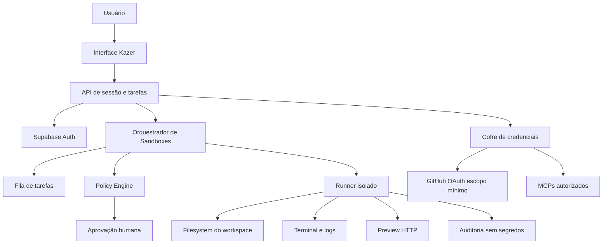

# Kazer Sandbox Computer

> Documento-base do futuro computador de desenvolvimento individual do Kazer.
>
> **Status:** planejamento — não implementar infraestrutura de produção sem uma revisão de segurança, custo e isolamento.
>
## 1. Visão

O **Kazer Sandbox Computer** será um ambiente de computação isolado por usuário, operado pelo Kazer por meio de um agente com permissões controladas. A proposta é oferecer algo mais poderoso do que um chat: um espaço onde o usuário possa abrir um projeto, trabalhar com arquivos, executar comandos, testar aplicações, navegar em documentação e operar repositórios GitHub autorizados.

O ambiente deve se comportar como um computador de desenvolvimento controlado, não como uma máquina com acesso irrestrito. Toda ação sensível precisa ser visível, auditável e, quando necessário, aprovada pelo usuário.

## 2. Princípios não negociáveis

1. **Isolamento por usuário:** filesystem, processos, tokens, cookies, rede, logs e limites nunca podem cruzar entre usuários.
2. **Menor privilégio:** o agente recebe somente o acesso necessário para a tarefa atual.
3. **Aprovação humana:** push, pull request, deploy, exclusão, alteração de secrets, instalação privilegiada e ações financeiras exigem confirmação explícita.
4. **Branch de trabalho por padrão:** o Kazer não altera diretamente a branch principal.
5. **Reversibilidade:** snapshots, diff, rollback e encerramento seguro precisam existir antes de liberar operações destrutivas.
6. **Transparência:** o usuário deve saber qual conector, repositório, ferramenta, comando e recurso estão sendo usados.
7. **Segredos fora do prompt:** tokens não devem ser enviados ao modelo nem aparecer em URLs, logs, arquivos do workspace ou respostas.
8. **Orçamento controlado:** CPU, RAM, disco, rede, tempo de execução e custo de modelos devem possuir limites explícitos.
9. **Conteúdo externo é dado não confiável:** README, issues, páginas web, dependências e arquivos podem conter prompt injection ou comandos maliciosos.
10. **Desligamento seguro:** ambientes ociosos devem ser pausados ou destruídos conforme a política escolhida, com aviso e opção de exportação.

## 3. Escopo do produto

### 3.1 MVP — Kazer DevBox efêmero

- Workspace Linux isolado por tarefa.
- Terminal web com logs em tempo real.
- Sistema de arquivos temporário.
- Git e clone de repositórios autorizados.
- Branch automática por tarefa.
- Leitura e edição de arquivos.
- Execução de testes e comandos permitidos.
- Preview HTTP temporário.
- Diff visual antes de qualquer publicação.
- Aprovação antes de commit, push ou pull request.
- Encerramento automático após inatividade.
- Exportação de patch, logs e resultado.

### 3.2 Fase seguinte — Workspace persistente

- Disco persistente criptografado por usuário.
- Projetos salvos e retomáveis.
- Configuração pessoal de ferramentas.
- Snapshots e restauração.
- Processos longos com fila e status.
- Tarefas agendadas com limites claros.
- Mais de um projeto isolado dentro da conta.

### 3.3 Fase avançada — Computador visual

- Navegador remoto em perfil separado.
- Desktop Linux remoto opcional.
- Aplicações gráficas controladas.
- Acesso por web, tablet e celular.
- Compartilhamento temporário de sessão.
- Colaboração e revisão em tempo real.

O desktop visual não deve ser o primeiro passo. O DevBox atende o principal caso de desenvolvimento com menor custo e superfície de ataque.

## 4. Arquitetura-alvo



### 4.1 Componentes

| Componente | Responsabilidade | Regra de segurança |
|---|---|---|
| Interface | Terminal, arquivos, diff, aprovações e status | Não recebe service role nem segredo persistente |
| API de sessão | Cria, pausa, retoma e encerra sandboxes | Verifica usuário, workspace e origem |
| Orquestrador | Agenda tarefas e aplica quotas | Não executa comandos diretamente no processo da API |
| Policy Engine | Classifica comandos, rede e operações sensíveis | Deny-by-default para ações perigosas |
| Runner | Executa processos dentro do ambiente isolado | Sem privilégio desnecessário e com limites de recursos |
| Filesystem | Armazena arquivos do workspace | Volume separado, criptografado e com quota |
| Cofre | Entrega credenciais temporárias | Nunca expõe token ao modelo ou ao frontend |
| Auditoria | Registra comando, resultado e aprovação | Redação de tokens, senhas e dados sensíveis |
| Preview Gateway | Expõe aplicações temporárias | URL aleatória, expiração e autenticação |

## 5. Isolamento técnico

A implementação deve escolher entre container endurecido e microVM conforme o risco. Para tarefas de baixo risco e curta duração, um container com sandboxing forte pode ser suficiente. Para execução de código arbitrário, navegador remoto ou instalação de pacotes não confiáveis, microVMs oferecem uma fronteira mais adequada.

Cada sandbox precisa de:

- identidade própria;
- filesystem e volume próprios;
- namespace de processos e rede isolados;
- limite de CPU, RAM, disco, processos e tempo;
- egress de rede controlado;
- ausência de acesso ao socket Docker do host;
- ausência de acesso ao host, `/proc` sensível e credenciais de infraestrutura;
- imagem versionada e verificável;
- snapshot antes de operações de risco;
- encerramento e limpeza determinísticos.

## 6. GitHub

O GitHub deve continuar usando OAuth. O fluxo recomendado é:

1. o usuário conecta o GitHub pela tela oficial;
2. escolhe conta, organização e repositórios autorizados;
3. o Kazer registra o escopo concedido;
4. o sandbox recebe uma credencial temporária e limitada;
5. a tarefa começa em uma branch própria;
6. o agente analisa, edita e testa;
7. o usuário revisa diff, arquivos e testes;
8. push ou pull request ocorre somente após aprovação.

Por padrão, bloquear:

- push direto na branch principal;
- exclusão de branch;
- alteração de secrets;
- alteração de workflows de deploy;
- releases e tags protegidas;
- alteração de permissões da organização;
- ações fora dos repositórios escolhidos.

## 7. Modelo de autorização de comandos

Cada comando deve ser classificado antes da execução:

| Classe | Exemplos | Comportamento |
|---|---|---|
| Seguro | `ls`, leitura de arquivo, testes locais, `git diff` | Pode executar dentro do limite |
| Observável | instalação de dependência, build, servidor local | Executa com log e quota |
| Sensível | escrita ampla, alteração de configuração, acesso externo | Explica impacto e pode exigir aprovação |
| Destrutivo | `rm`, reset, limpeza de volume, exclusão de branch | Bloqueia ou exige aprovação explícita |
| Proibido | acesso ao host, escalada, exfiltração, bypass de sandbox | Bloqueia e registra o motivo |

A classificação não pode depender apenas de regex. Deve combinar parser, allowlist de capacidades, contexto da tarefa, usuário, workspace e política vigente.

## 8. Credenciais e conectores

- GitHub, MCP e outros conectores devem usar tokens temporários quando possível.
- Segredos ficam em cofre server-side e são injetados somente no processo autorizado.
- O modelo recebe uma descrição da capacidade, não o valor do segredo.
- Logs passam por redaction antes de serem persistidos ou exibidos.
- Todo acesso registra usuário, workspace, conector, escopo, horário e motivo.
- Rotação e revogação precisam ser possíveis sem recriar todos os workspaces.
- O sandbox não deve reutilizar cookies do navegador pessoal sem uma sessão explícita e isolada.

## 9. Rede

A rede deve começar bloqueada e ser liberada por política:

- allowlist para GitHub, registries e documentação necessários;
- bloqueio de IPs privados, metadata endpoints e loopback;
- resolução DNS validada antes da conexão;
- proteção contra DNS rebinding;
- limites de banda e conexões;
- proxy de egress auditável para ambientes de maior risco;
- nenhum acesso administrativo à rede interna do Kazer.

## 10. Máquina de estados

```text
REQUESTED
   ↓
PROVISIONING → FAILED
   ↓
READY
   ↓
RUNNING ↔ PAUSED
   ↓
AWAITING_APPROVAL
   ├── APPROVED → RUNNING
   └── REJECTED → PAUSED
   ↓
COMPLETED / EXPIRED / DESTROYED
```

Toda transição deve ser idempotente. O usuário deve conseguir ver a causa de falha, a última ação confirmada e o que será perdido ao destruir o ambiente.

## 11. Dados a persistir

### Workspace

- `id`, `user_id`, `name`, `status`;
- imagem e versão do runner;
- região, quotas e expiração;
- created/updated/last_active;
- volume e snapshot associados;
- política de retenção.

### Tarefa

- `id`, `workspace_id`, `user_id`;
- intenção original;
- plano apresentado;
- comandos executados;
- resultados e testes;
- diff e artefatos;
- aprovações e rejeições;
- custo estimado e real;
- status e timestamps.

Nunca persistir tokens, senhas, cookies ou conteúdo sensível sem uma política específica e consentimento adequado.

## 12. Observabilidade e auditoria

Cada tarefa deve produzir:

- timeline de eventos;
- comando normalizado;
- saída redigida;
- arquivos alterados;
- testes executados;
- aprovação associada;
- consumo de recursos;
- custo do modelo e duração;
- motivo de encerramento.

A auditoria deve permitir responder: **quem fez o quê, em qual ambiente, com qual permissão, em qual arquivo, com qual resultado e depois de qual aprovação?**

## 13. Limites técnicos de recursos

Antes de lançar qualquer execução persistente, definir quotas técnicas independentes do custo bruto da infraestrutura:

- minutos de execução;
- CPU e RAM máximas;
- armazenamento;
- tráfego;
- número de workspaces;
- tempo de preview;
- tarefas simultâneas;
- custo de modelos e conectores.

O sandbox pode começar com execução efêmera e limites baixos. Persistência, maior tempo de execução e mais recursos devem depender de uma decisão explícita do produto e de controles técnicos mensuráveis.

## 14. Roadmap técnico

### P0 — Fundamentos

- [ ] Definir threat model e fronteira de isolamento.
- [ ] Escolher container endurecido ou microVM para o MVP.
- [ ] Definir quotas, retenção e orçamento por usuário.
- [ ] Criar modelo de dados de workspace, tarefa e auditoria.
- [ ] Implementar state machine idempotente.
- [ ] Implementar policy engine deny-by-default.
- [ ] Integrar GitHub OAuth com escopo mínimo e branch de trabalho.
- [ ] Criar snapshot, diff e rollback.

### P1 — DevBox utilizável

- [ ] Terminal web com streaming de logs.
- [ ] Filesystem e preview isolados.
- [ ] Execução de testes e artefatos.
- [ ] Aprovação de comandos sensíveis.
- [ ] Cofre de credenciais temporárias.
- [ ] Redaction e auditoria.
- [ ] Testes de isolamento multiusuário.
- [ ] Testes de abuso, SSRF, prompt injection e escape de sandbox.

### P2 — Persistência e navegador

- [ ] Workspace persistente criptografado.
- [ ] Navegador remoto com perfil separado.
- [ ] Pausa, retomada e snapshots.
- [ ] Tarefas longas e fila.
- [ ] Acesso mobile e tablet.
- [ ] Colaboração e compartilhamento temporário.

### P3 — Computador visual

- [ ] Desktop remoto opcional.
- [ ] Aplicações gráficas controladas.
- [ ] Instalação de ferramentas aprovada.
- [ ] Integração de múltiplos monitores quando aplicável.
- [ ] Recuperação de sessão e suporte operacional.

## 15. Critérios de lançamento do MVP

O MVP só pode ser liberado quando:

- nenhum usuário consegue listar ou acessar arquivos de outro usuário;
- um sandbox não consegue acessar o host ou outro sandbox;
- tokens não aparecem em frontend, URL, logs ou prompt;
- comandos destrutivos são bloqueados ou aprovados;
- push em branch protegida exige aprovação;
- SSRF e metadata endpoints estão bloqueados;
- quotas impedem abuso e custos inesperados;
- snapshot e rollback foram testados;
- falhas de provisionamento limpam recursos parciais;
- duas contas de teste passam todos os testes de isolamento;
- o usuário consegue exportar resultado e entender o que será destruído;
- a política de privacidade, retenção e suporte foi publicada.

## 16. Decisões pendentes

- O primeiro lançamento terá somente DevBox ou também navegador remoto?
- O workspace será efêmero por tarefa ou persistente desde o início?
- Qual fornecedor de sandbox oferece a fronteira de isolamento necessária?
- Quais linguagens e ferramentas serão suportadas na imagem inicial?
- Quais repositórios e escopos GitHub serão permitidos?
- O preview será público protegido por token ou privado para o usuário?
- Quais quotas técnicas existirão no Free e no Pro?
- Qual é a política de retenção e exportação?
- Que ações exigirão aprovação sempre?
- Qual procedimento existirá para incidente, revogação e destruição emergencial?

## 17. Regra de implementação futura

Nenhuma implementação de produção deve ser adicionada a este arquivo sem:

1. threat model atualizado;
2. decisão de plataforma e isolamento;
3. migration/schema revisado;
4. testes multiusuário;
5. testes de escape e SSRF;
6. limites de custo definidos;
7. plano de rollback;
8. revisão humana de segurança.

Este documento é a fonte inicial de planejamento do **Kazer Sandbox Computer**. O código futuro deve referenciar suas decisões e atualizar este arquivo quando uma decisão for tomada.
